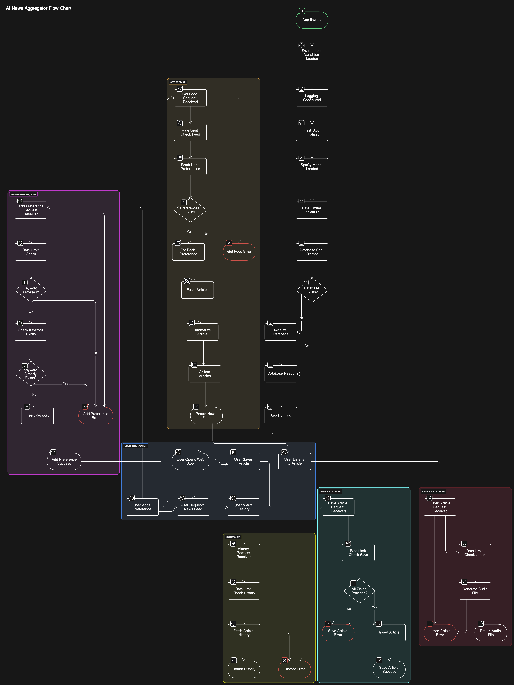

#  AI News Aggregator

<div align="center">
  
</div>

Welcome to the **AI News Aggregator**, a powerful, user-friendly web application designed to provide personalized news feeds based on your preferences. Simplify the way you stay informed by aggregating the latest news based on topics you care about! 🚀

## 📱 Screenshots

### Main Page
<div align="center">
  
</div>

### Article History
<div align="center">
  
</div>

---

## 🏗️ Project Architecture

<div align="center">
  
</div>

The application follows a modular architecture with distinct components:

### Core Components:
1. **App Initialization**
   - Environment setup
   - Database configuration
   - API initialization

2. **News Feed Management**
   - User preferences handling
   - Article fetching and caching
   - Content summarization

3. **User Interaction**
   - Article saving
   - History tracking
   - Audio conversion

4. **Error Handling**
   - Graceful error management
   - User feedback
   - Recovery mechanisms

---

## 📋 Features

- **Personalized News Feed**: Add topics of interest and get news tailored just for you
- **Keyword-Based Preferences**: Easily input keywords to customize your news
- **Interactive UI**: Modern, responsive, and elegant design with dark mode support
- **Article History**: Enhanced history tracking with thumbnails and metadata
- **Listen to Articles**: Text-to-Speech (TTS) feature for hands-free news consumption
- **Save Articles**: Bookmark articles with tags for better organization
- **Efficient Navigation**: Fast and fluid interface with smooth animations
- **Dark Mode**: Toggle between light and dark themes for comfortable reading

---

## 🛠️ Tech Stack

- **Frontend**:
  - HTML5
  - CSS3 (Modern design with CSS variables)
  - JavaScript (Async operations, smooth animations)
  - Font Awesome icons

- **Backend**:
  - Flask (Python)
  - SQLite (Database)
  - spaCy (Text processing)
  - gTTS (Text-to-Speech)

- **APIs & Services**:
  - News API integration
  - Rate limiting
  - Connection pooling
  - Caching system

---

## 🎨 UI Features

- **Modern Design**:
  - Clean, card-based layout
  - Smooth animations and transitions
  - Gradient accents and shadows
  - Responsive grid system

- **Interactive Elements**:
  - Animated buttons and cards
  - Toast notifications
  - Loading indicators
  - Hover effects

- **Article Cards**:
  - Thumbnail images
  - Rich metadata display
  - Action buttons with icons
  - Tag system

---

## 🚀 Getting Started

### Prerequisites:
1. Python 3.x
2. pip package manager
3. News API key from [NewsAPI](https://newsapi.org/)

### Installation:
1. Clone the repository:
   ```bash
   git clone https://github.com/yourusername/ai-news-aggregator.git
   cd ai-news-aggregator
   ```

2. Create and activate virtual environment:
   ```bash
   python -m venv venv
   source venv/bin/activate  # For Linux/macOS
   venv\Scripts\activate     # For Windows
   ```

3. Install dependencies:
   ```bash
   pip install -r requirements.txt
   ```

4. Set up environment variables:
   - Create a `.env` file in the root directory
   - Add your News API key and other configuration:
     ```
     NEWS_API_KEY=your_api_key_here
     FLASK_ENV=development
     FLASK_DEBUG=1
     ```

5. Initialize the database:
   ```bash
   python ai_news_aggregator/app.py
   ```

6. Access the application:
   ```
   http://127.0.0.1:5000
   ```

### Environment Variables
The following environment variables are required:

- `NEWS_API_KEY`: Your News API key from [NewsAPI](https://newsapi.org/)
- `FLASK_ENV`: Set to 'development' or 'production'
- `FLASK_DEBUG`: Set to 1 for development, 0 for production

### Troubleshooting
If you encounter any issues:

1. **Database Connection Issues**:
   - Ensure the `db` directory exists and is writable
   - Check if SQLite is properly installed

2. **API Key Issues**:
   - Verify your News API key is correct
   - Check if you've reached the API rate limit

3. **Text-to-Speech Issues**:
   - Ensure gTTS is properly installed
   - Check internet connectivity for TTS services

---

## 📂 Project Structure

```