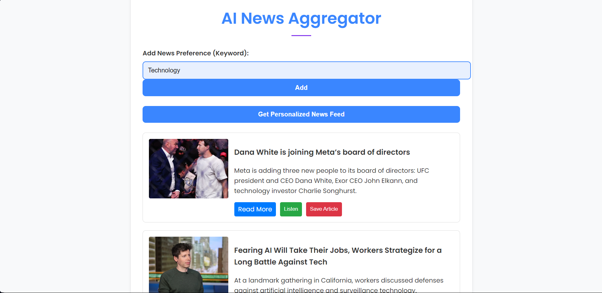

# 🌐 AI News Aggregator  

Welcome to the **AI News Aggregator**, a powerful, user-friendly web application designed to provide personalized news feeds based on your preferences. Simplify the way you stay informed by aggregating the latest news based on topics you care about! 🚀  

---

## 📋 Features  

- **Personalized News Feed**: Add topics of interest and get news tailored just for you.  
- **Keyword-Based Preferences**: Easily input keywords to customize your news.  
- **Interactive UI**: Modern, responsive, and elegant design for an enjoyable browsing experience.  
- **Article History**: Track articles you've read for easy access later.  
- **Listen to Articles**: Enjoy a hands-free experience by listening to news articles directly through the app with a built-in Text-to-Speech (TTS) feature.  
- **Save Articles**: Save articles for future reading, allowing you to create your personal collection of important stories.  
- **Efficient Navigation**: Fast and fluid interface powered by JavaScript.  

---

## 🛠️ Tech Stack  

- **Frontend**:  
  - HTML5  
  - CSS3 (Responsive & Styled for a sleek look)  
  - JavaScript  

- **Backend**: Flask (Python)  
- **APIs**: News APIs for fetching live data  
- **Styling Tools**: Google Fonts, Animations, and custom CSS variables for theming.  
- **Text-to-Speech (TTS)**: Integrated TTS feature to allow listening to articles.  

---

## 🎨 UI Highlights  

- Clean and responsive **container-based layout**.  
- **Modern typography** using the "Poppins" font for readability.  
- Subtle hover and focus effects for buttons, inputs, and cards.  
- Animated article entries with a **fade-in effect**.  
- **TTS Button**: A dedicated button for each article to activate the listen feature.  
- **Save Button**: A button to save articles to your personal reading list.  
- Mobile-friendly design to ensure accessibility across devices.  

---

## 🚀 How to Run Locally  

### Prerequisites:  
1. Python 3.x installed on your system.  
2. Install `pip` for managing dependencies.  
3. **API Key**: You need to obtain a News API key. Sign up at [NewsAPI](https://newsapi.org/) or another supported provider and copy your API key.  

### Steps:  
1. Clone the repository:  
   ```bash  
   git clone https://github.com/Soumo-git-hub/ai-news-aggregator.git  
   cd ai-news-aggregator  
   ```  
2. Create a virtual environment (optional but recommended):  
   ```bash  
   python -m venv venv  
   source venv/bin/activate  # For Linux/macOS  
   venv\Scripts\activate     # For Windows  
   ```  
3. Install dependencies:  
   ```bash  
   pip install -r requirements.txt  
   ```  
4. Add your API key:  
   - Open the `app.py` file.  
   - Replace the placeholder text `<YOUR_API_KEY>` with your actual API key.  
     ```python  
     API_KEY = "<YOUR_API_KEY>"  
     ```  
5. Run the Flask application:  
   ```bash  
   python app.py  
   ```  
6. Open your browser and navigate to:  
   ```  
   http://127.0.0.1:5000  
   ```  

---

## 📂 Project Structure  

```
ai-news-aggregator/  
│  
├── static/  
│   ├── css/  
│   │   └── styles.css      # Stylish frontend design  
│   └── js/  
│       └── app.js          # Core frontend interactivity  
│  
├── templates/  
│   └── index.html          # Main HTML template  
│  
├── app.py                  # Flask backend server  
├── requirements.txt        # Python dependencies  
└── README.md               # Project documentation (this file)  
```  

---

## 🖼️ Screenshots  

### Homepage  
  

### Personalized News Feed with Listen and Save Feature  
  

---

## 🛡️ License  

This project is licensed under the **MIT License**. Feel free to use, modify, and distribute the code. See `LICENSE` for details.  

---

## 📞 Contact  

👤 **Soumyadyuti Dey**  
📧 Email: deysoumyadyuti@gmail.com  
🔗 GitHub: [Soumo-git-hub](https://github.com/Soumo-git-hub)  

---

## 🌟 Contribute  

Want to improve this project? Feel free to fork the repo, make changes, and create a pull request! Contributions are always welcome.  

---